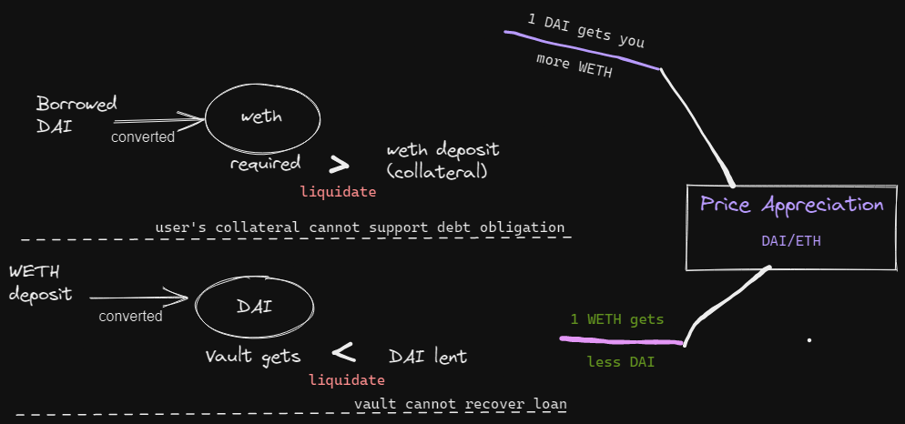

# Collateralised Vault
Project #5 for Arcane x CertiK Developer Workshop: https://calnix.gitbook.io/eth-dev/  
Problem Statement: https://github.com/yieldprotocol/mentorship2022/issues/5

## Objectives
* Contract allows users to deposit an asset they own (collateral), to borrow a different asset that the Vault owns (underlying). 
* Exchange rate determined by oracle.
* If value of collateral drops in underlying terms, the user will be liquidated.
* User can deposit WETH as collateral, and borrow DAI against it.

## Sequence
1. Users deposit WETH into Vault
2. Users borrow DAI against their WETH collateral
3. Loan is considered healthy as long as the Vault does not lose money.  
    1. This happens when:
    * The weth collateral held by the Vault is worth less than DAI lent
    * Vault cannot sell weth at market price to collect back DAI lent
    2. This occurs when price appreciates:
        1. Initial DAI/WETH price: 0.00038637284
            * price appreciation
            * 1 DAI : 0.38637284 WETH
        2. 1 DAI gets your more WETH
        3. But that means to get the same amount of DAI, Vaul needs more WETH.
4. Liquidation occurs when the WETH collateral, calculated in weth terms.
* If value of collateral drops in underlying terms, the user will be liquidated.

## Tokens
Collateral: WETH
Underlying: DAI

## Contracts
1. Pull the contract code for both from Etherscan
2. Add a mint() function that allows you to obtain as much as you need for testing.

## Workflow
1. Users deposit WETH into Vault, 
    - (WETH frm User to Vault. Vault recirds WETH deposited.)

2. Users *borrow* DAI against their WETH
    - as long as the value DAI they borrow in WETH terms is less than the value of their WETH collateral
    - DAI_value_in_WETH < WETH Collateral
    - Vault sends DAI to the users.
    - Vault owner finances DAI to the Vault on construction.

3. Exchange rate: Chainlink Oracle [https://docs.chain.link/docs/ethereum-addresses]

4. *Users can repay debt in DAI*

5. *Withdrawal* 
    - To withdraw WETH, the users must repay the DAI they borrowed.

6. Liquidation
    - If ETH/DAI price changes such tt **debt_value** *>* **collateral_value**, 
    Vault will erase user records from the contract -> cancelling the user debt, and at the same time stopping that user from withdrawing their collateral.

(https://1733885843-files.gitbook.io/~/files/v0/b/gitbook-x-prod.appspot.com/o/spaces%2FTgomzlmn9NrxUY0OQ3cD%2Fuploads%2FfMw1V1lKmxE7suN2JUGs%2FUntitled-2022-05-08-1843.excalidraw.png?alt=media&token=13abcd1e-710c-44c2-ad9d-f804b55bd501)